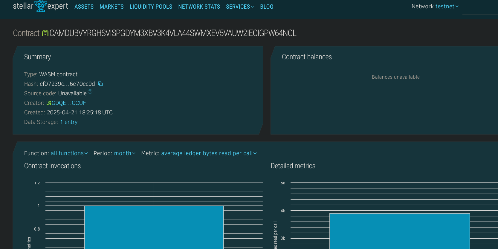

# Vaccine Certificate Verifier

## Project Description
A decentralized vaccine certificate management system built on the Stellar blockchain using Soroban smart contracts. This system allows issuing, storing, and verifying digital vaccine certificates securely and transparently.

## Project Vision
To offer a secure and tamper-proof vaccine certificate system that ensures public trust, simplifies verification, and supports global health efforts.

## Key Features
- 💉 **Certificate Issuance**: Issue unique vaccine certificates with person and vaccine details.
- ✅ **Verification Mechanism**: Authorities can verify the authenticity of a certificate.
- 🔍 **Public Lookup**: View certificate details by certificate ID.
- 🧮 **Certificate Count**: Keep track of total certificates issued.

## Future Scope
- 📲 **QR Code Integration**: Generate QR codes for easy scanning and verification.
- 👥 **Role-based Access Control**: Differentiate actions for users and health authorities.
- 🌐 **Multi-jurisdictional Support**: Add support for different national vaccine databases.
- 🧾 **Medical History Linking**: Extend certificates to include booster shots and medical logs.

## Contract Details
CAMDUBVYRGHSVISPGDYM3XBV3K4VLA44SWMXEV5VAUW2IECIGPW64NOL
